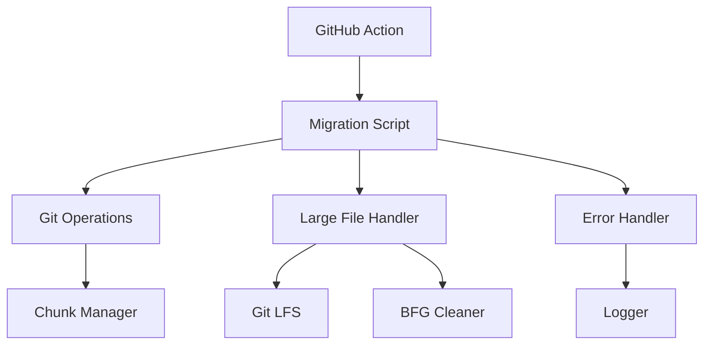

# System Patterns

## Architecture Overview
The system follows a modular design pattern with clear separation of concerns:

1. **Migration Core**
   - Repository cloning
   - History preservation
   - Branch management
   - Chunk-based pushing

2. **Large File Handling**
   - Git LFS integration
   - BFG Repo Cleaner integration
   - File size monitoring
   - Historical data management

3. **Error Handling**
   - Retry mechanism
   - Timeout management
   - Cleanup procedures
   - Logging system

## Design Patterns

### 1. Command Pattern
- Each Git operation encapsulated in `run_git_command` function
- Consistent error handling and retry logic
- Timeout management for long-running operations

### 2. Strategy Pattern
- Different strategies for handling large files:
  - Git LFS for current files
  - BFG for historical files
- Configurable chunk sizes
- Adjustable retry policies

### 3. Observer Pattern
- Comprehensive logging system
- Progress tracking
- Error reporting
- Status updates

## Component Relationships

## Error Handling Patterns

1. **Retry Pattern**
   - Configurable number of retries
   - Exponential backoff
   - Maximum timeout limits

2. **Cleanup Pattern**
   - Automatic cleanup on error
   - Temporary file management
   - Resource release

3. **Logging Pattern**
   - Timestamp-based logging
   - Error context preservation
   - Operation tracking

## Security Patterns

1. **Authentication**
   - Token-based authentication
   - Secure credential handling
   - No hardcoded secrets

2. **File Security**
   - Safe file operations
   - Proper cleanup
   - Access control

## Performance Patterns

1. **Chunking Strategy**
   - Configurable chunk sizes
   - Memory-efficient processing
   - Progress tracking

2. **Resource Management**
   - Git configuration optimization
   - Memory usage control
   - Disk space management 