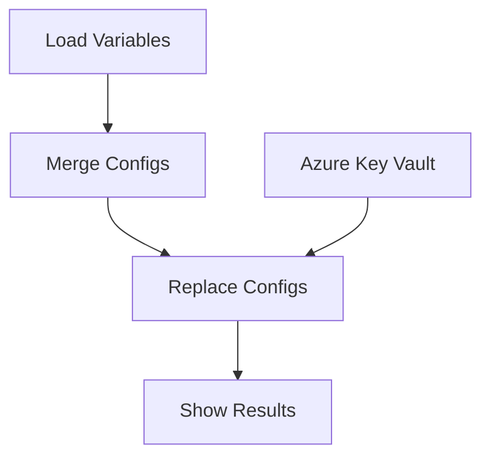

# System Patterns

## Architecture Overview
The system follows a modular workflow-based architecture using GitHub Actions, with clear separation of concerns:

## Key Technical Decisions

### 1. Workflow Structure
- Separate jobs for different responsibilities
- Matrix strategy for parallel environment processing
- Conditional execution based on job outputs
- Artifact sharing between jobs

### 2. Variable Management
- Environment-specific variable loading
- Centralized variable merging
- Secure secret handling
- Variable validation and error handling

### 3. Configuration Processing
- Support for multiple config file formats
- Pattern-based placeholder replacement
- XML structure preservation
- Error handling and validation

### 4. Security Patterns
- Azure Key Vault integration
- Secure credential handling
- Environment isolation
- Secret rotation support

## Design Patterns

### 1. Pipeline Pattern
- Sequential job execution
- Dependency management
- Artifact passing
- Error propagation

### 2. Strategy Pattern
- Environment-specific variable loading
- Configurable replacement strategies
- Extensible secret management

### 3. Observer Pattern
- Job status monitoring
- Result validation
- Error reporting

### 4. Factory Pattern
- Config file processing
- Variable merging
- Secret retrieval

## Component Relationships

### 1. Workflow Components
- `load-variables`: Initial variable loading
- `merge-configs`: Variable consolidation
- `replace-configs`: Configuration updates
- `show-results`: Execution feedback

### 2. Supporting Components
- Azure Key Vault integration
- GitHub Actions artifacts
- Environment contexts
- Configuration files

### 3. Integration Points
- GitHub Environments
- Azure Key Vault
- Configuration files
- GitHub Actions API 